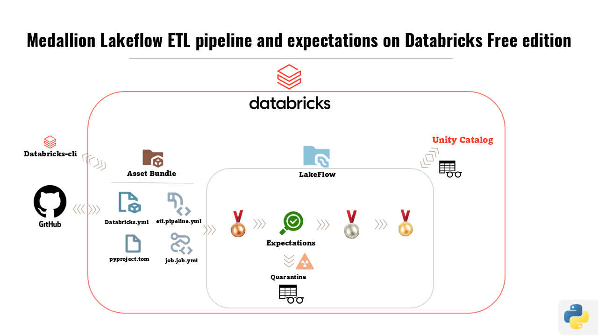

# Databricks TPC-H Lakeflow demo (Free Edition friendly)



End to end Databricks Lakeflow project using the public **TPC-H** sample data and **Databricks Free Edition**.

This TPC-H benchmark dataset simulates a wholesale supplier business. Customers from different nations and regions place orders for parts provided by various suppliers. The core tables capture customers, suppliers, parts, orders and individual order lines, giving us a realistic base to build a star schema and sales analytics on top.

The goal is **learning + reproducibility**:
- Start from a clean workspace
- Build **Bronze / Silver / Gold** layers with **Spark Declarative Pipelines**
- Keep everything **versioned in Git**
- Call out the **pitfalls and fixes** you'll hit on Free Edition

---

## 1. What this project builds

**Tech stack**

- Databricks Lakeflow Pipelines (serverless, Free Edition)
- Unity Catalog (default *workspace* catalog, custom schema)
- Spark Declarative Pipelines API (`pyspark.pipelines as dp`)
- Git backed source controlled project (Git folders)

**Data & model**

- Source: Databricks sample dataset **TPC H (~50M rows)** from `samples.tpch`
- Layers:

  - **Bronze**  
    Raw TPC H tables copied into your `workspace.<schema>` with ingest metadata:
    - `_ingest_ts`
    - `_ingest_file` (from `_metadata.file_path`)

  - **Silver**  
    Cleaned star schema:
    - Dimensions: `dim_customer`, `dim_part`, `dim_supplier`, `dim_nation`,
      `dim_region`, `dim_calendar`, `dim_orders`
    - Fact: `fact_lineitem` (line grain) + `fact_lineitem_quarantine`
    - Expectations (data quality):
      - PK not null on all dims
      - Quantity > 0, net_revenue >= 0, order_date not null on fact
    - Quarantine keeps **bad rows** instead of dropping them.

  - **Gold**  
    Reporting tables:
    - `gold_daily_sales` - daily revenue / discount / tax
    - `gold_sales_by_segment` - revenue by market segment
    - `gold_sales_by_region` - revenue by region
    - `gold_top_customers` - top customers by revenue

- Tables description:

  - CUSTOMER / dim_customer - end customers of the wholesale business, with address, phone, account balance and market segment.

  - SUPPLIER / dim_supplier - companies providing the parts, with location and financial balance.

  - PART / dim_part - products sold (parts), with brand, type, size, container and list price.

  - ORDERS / dim_orders - order headers: who ordered, when, status, priority and clerk.

  - LINEITEM / fact_lineitem - order lines: each product within an order, including quantities, discounts, taxes and derived revenue.

  - NATION / dim_nation - countries, linked to regions.

  - REGION / dim_region - broader geographic areas (e.g. EUROPE, AMERICA).

  - CALENDAR / dim_calendar - derived calendar dimension built from order dates.

---

## 2. Prerequisites

- Databricks **Free Edition** workspace
- Unity Catalog enabled (default *workspace* catalog is enough)
- Git integration configured (GitHub recommended)
- Databricks Runtime that supports `pyspark.pipelines`  
  (any Lakeflow-enabled runtime in Free Edition works at the time of writing)

---

## 3. High‑level setup steps

1. **Create schema**

   In Catalog Explorer (or SQL):

   ```sql
   CREATE SCHEMA IF NOT EXISTS workspace.lf_demo;
   ```

2. **Create a Git-backed project**

   - In the Databricks UI: **Workspace → Git folders → New Git folder**
   - Point it to your GitHub repo
   - In that Git folder create a folder, for example: `rvmlakeflow_etl`

3. **Add Databricks asset bundle** **(Within Databricks UI got to Jobs & pipelines > create new ETL > set up as a source-controlled project)**

   In your project folder create `databricks.yml` similar to:

   ```yaml
   bundle:
     name: rvmlakeflow

   include:
     - resources/*.yml
     - resources/**/*.yml

   variables:
     catalog:
       description: The catalog to use
     schema:
       description: The schema to use

   targets:
     dev:
       mode: development
       default: true
       workspace:
         host: https://<your-workspace>.cloud.databricks.com
         variables:
           catalog: workspace
           schema: lf_demo
     prod:
       mode: production
       workspace:
         host: https://<your-workspace>.cloud.databricks.com
         root_path: /Workspace/Users/<you>/.bundle/${bundle.name}/${bundle.target}
         variables:
           catalog: workspace
           schema: lf_demo
   ```

4. **Define the Lakeflow pipeline resource**

   Under `resources/` create `rvmlakeflow_etl.pipeline.yml`:

   ```yaml
   resources:
     pipelines:
       rvmlakeflow_etl:
         name: rvmlakeflow_etl
         catalog: ${var.catalog}
         schema: ${var.schema}
         serverless: true
         root_path: "../src/rvmlakeflow_etl"

         libraries:
           - glob:
               include: ../src/rvmlakeflow_etl/transformations/**
   ```

   > **Free Edition gotcha**  
   > Do **not** configure a pip `--editable` dependency in `environment.dependencies`.  
   > On Free Edition Lakeflow clusters it fails with `ENVIRONMENT_PIP_INSTALL_ERROR`.

5. **Create transformation package**

   In `src/rvmlakeflow_etl/transformations/` add:

   - `common.py`
   - `bronze.py`
   - `silver.py`
   - `gold.py`

   (Code is not repeated here to keep the README short. It mirrors the repo version.)

6. **Create the Lakeflow pipeline from the UI**

   - Go to **Workflows → Jobs & Pipelines -> ETL pipeline**
   - Choose **Source controlled project**
   - Select your Git folder & branch
   - Pick the pipeline definition file `rvmlakeflow_etl.pipeline.yml`
   - Set:
     - **Default catalog**: `workspace`
     - **Default schema**: `lf_demo`
   - Complete the wizard. -> Left personal schema as YES. And after creation, on the top right corner select the correct schema. (if you try to set in the wizards personal schema "NO" the creation fails). A new pipeline appears under **Jobs & Pipelines**.

7. **Reconnect UI pipeline to bundle after edits**

   - If you ever click **“Unlock and edit anyway”** in pipeline settings,
     you'll see a banner: **“Redeploy to source”**.
   - After changing the `.pipeline.yml` in Git, open the pipeline,
     click **Redeploy to source** so the UI and bundle stay in sync.

---

## 4. Running the layers

1. **Bronze**

   - Open the `rvmlakeflow_etl` pipeline.
   - Run the pipeline.
   - Check `workspace.lf_demo` for tables like `bronze_customer`, `bronze_orders`, etc.
   - Quick SQL check:

     ```sql
     SELECT * FROM workspace.lf_demo.bronze_customer LIMIT 5;
     ```

2. **Silver**

   - Same pipeline run (Bronze and Silver live in the same file set).
   - Verify star schema:

     ```sql
     SHOW TABLES IN workspace.lf_demo LIKE 'dim_*';
     SHOW TABLES IN workspace.lf_demo LIKE 'fact_lineitem%';
     ```

   - Expectations show up in the **Tables** tab of the pipeline:
     - For each dim: `1 met` on the PK not‑null check
     - For fact: checks on quantity, net_revenue, order_date
   - Quarantine:

     ```sql
     SELECT COUNT(*) FROM workspace.lf_demo.fact_lineitem_quarantine;
     ```

3. **Gold**

   - Ensure `gold.py` is under the same `transformations/` folder.
   - Rerun the pipeline.
   - Validate:

     ```sql
     SHOW TABLES IN workspace.lf_demo LIKE 'gold_%';

     SELECT * FROM workspace.lf_demo.gold_daily_sales LIMIT 5;
     SELECT * FROM workspace.lf_demo.gold_sales_by_segment LIMIT 5;
     SELECT * FROM workspace.lf_demo.gold_sales_by_region LIMIT 5;
     SELECT * FROM workspace.lf_demo.gold_top_customers LIMIT 5;
     ```

---

## 5. Lakeflow expectations & quarantine strategy

- Expectations (`@dp.expect`) here are **informational**:
  - They do **not** drop rows by default.
  - They record metrics in the pipeline UI.
- To avoid silently losing data, bad rows are sent to a **quarantine table**:

  - Base fact builder: `_fact_lineitem_base()`
  - Main fact: `fact_lineitem` returns all rows
  - Quarantine: `fact_lineitem_quarantine` filters `NOT (valid_condition)`

This pattern makes data quality **visible** without hiding problems.

---

## 6. Incrementality

Databricks automatically infers incremental behavior from the pipeline graph:

- Bronze views reading from `samples.tpch` behave as full refresh.
- Silver dims & facts become **incremental** when the runtime can
  detect a primary key + timestamp / change feed pattern.
- In the UI you can see the incremental mode per table; no extra code was required.

---

## 7. CLI (optional, nice to have)

Once everything works in the UI, you can automate with the **Databricks CLI v0.205+**:

```bash
# From the root of the repo (where databricks.yml lives)
databricks bundle validate
databricks bundle deploy --target dev
databricks bundle run rvmlakeflow_etl --target dev
```

On Free Edition you might still prefer the UI for runs (no jobs costs to worry about),
but the bundle config already prepares you for CI/CD.

---

## 8. Useful validation queries

See `assets/validation_queries.sql` in this repo for a compact set of checks:

- Row counts by layer (Bronze vs Silver vs Fact)
- Revenue sanity checks
- Top customers / regions inspection
- Data quality statistics on quarantine

---

## 9. Known setbacks & fixes

See `assets/setbacks_and_fixes.md` for a chronological list of issues we hit
on Free Edition (pip install errors, `input_file_name` in Unity Catalog,
relative imports, expectations, incrementality) and how we fixed each one.

---


## 10. License

Use this as a learning asset or a base for your own Lakeflow projects.
No warranty; adapt config, naming and expectations to your environment.
